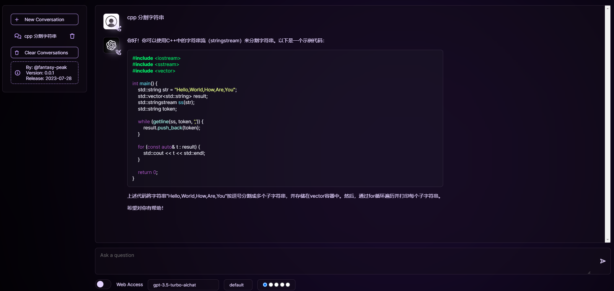

# Cpp FreeGPT WebUI

## GPT 3.5/4

<strong>NOT REQUIRE ANY API KEY</strong> ❌🔑

This project features a WebUI utilizing the [G4F API](https://github.com/xtekky/gpt4free). <br>
Experience the power of ChatGPT with a user-friendly interface, enhanced jailbreaks, and completely free.

## Getting Started :white_check_mark:  
To get started with this project, you'll need to clone the repository and have g++ >= 13.1 installed on your system.
  
### Cloning the Repository :inbox_tray:
Run the following command to clone the repository:  

```
git clone https://github.com/fantasy-peak/cpp-freegpt-webui.git
```

## Compile And Running the Application :rocket:
To run the application, run the following command:

```
1. Check local g++ version, need g++ version >= gcc version 13.1.0 (GCC)

2. install xmake
wget https://github.com/xmake-io/xmake/releases/download/v2.8.2/xmake-v2.8.2.xz.run
chmod 777 xmake-v2.8.2.xz.run
./xmake-v2.8.2.xz.run
source ~/.xmake/profile

3. install libcurl-impersonate, ubuntu (apt-get install libcurl4-openssl-dev) centos7 (yum install libcurl-devel.x86_64)
wget https://github.com/lwthiker/curl-impersonate/releases/download/v0.5.4/libcurl-impersonate-v0.5.4.x86_64-linux-gnu.tar.gz
sudo mv libcurl-impersonate-v0.5.4.x86_64-linux-gnu.tar.gz /usr/lib64
cd /usr/lib64
sudo tar -xvf libcurl-impersonate-v0.5.4.x86_64-linux-gnu.tar.gz
export LD_LIBRARY_PATH=/usr/lib64:$LD_LIBRARY_PATH
export LIBRARY_PATH=/usr/lib64:$LIBRARY_PATH

4. Compiling
git clone https://github.com/fantasy-peak/cpp-freegpt-webui.git
cd cpp-freegpt-webui
xmake build -v
xmake install -o .
cd bin
./cpp-freegpt-webui ../cfg/cpp-free-gpt.yml
```

Access the application in your browser using the URL:
```
http://127.0.0.1:8858/chat
```

### Running the Docker
Pull the Docker image from Docker Hub:
```
docker pull fantasypeak/freegpt:latest
```

Run the application using Docker:
```
docker run --net=host -it --name freegpt fantasypeak/freegpt:latest
// OR
docker run -p 8858:8858 -it --name freegpt fantasypeak/freegpt:latest
// use http_proxy
docker run -p 8858:8858 -it --name freegpt -e HTTP_PROXY=http://127.0.0.1:8080 -e CHAT_PATH=/chat fantasypeak/freegpt:latest
// set active providers
docker run -p 8858:8858 -it --name freegpt -e CHAT_PATH=/chat -e PROVIDERS="[\"gpt-4-ChatgptAi\",\"gpt-3.5-turbo-stream-DeepAi\"]" fantasypeak/freegpt:latest
// enable ip white list function
docker run -p 8858:8858 -it --name freegpt -e IP_WHITE_LIST="[\"127.0.0.1\",\"192.168.1.1\"]" fantasypeak/freegpt:latest
```

### Call OpenAi Api
```
// It supports calling OpenAI's API, but need set API_KEY
docker run -p 8858:8858 -it --name freegpt -e CHAT_PATH=/chat -e API_KEY=a40f22f2-c1a2-4b1d-a47f-55ae1a7ddbed fantasypeak/freegpt:latest
```

### WebUI
The application interface was incorporated from the [chatgpt-clone](https://github.com/xtekky/chatgpt-clone) repository.



### API G4F
The free GPT-4 API was incorporated from the [GPT4Free](https://github.com/xtekky/gpt4free) repository.

## Legal Notice
This repository is _not_ associated with or endorsed by providers of the APIs contained in this GitHub repository. This
project is intended **for educational purposes only**. This is just a little personal project. Sites may contact me to
improve their security or request the removal of their site from this repository.

Please note the following:

1. **Disclaimer**: The APIs, services, and trademarks mentioned in this repository belong to their respective owners.
   This project is _not_ claiming any right over them nor is it affiliated with or endorsed by any of the providers
   mentioned.

2. **Responsibility**: The author of this repository is _not_ responsible for any consequences, damages, or losses
   arising from the use or misuse of this repository or the content provided by the third-party APIs. Users are solely
   responsible for their actions and any repercussions that may follow. We strongly recommend the users to follow the
   TOS of the each Website.

3. **Educational Purposes Only**: This repository and its content are provided strictly for educational purposes. By
   using the information and code provided, users acknowledge that they are using the APIs and models at their own risk
   and agree to comply with any applicable laws and regulations.

4. **Copyright**: All content in this repository, including but not limited to code, images, and documentation, is the
   intellectual property of the repository author, unless otherwise stated. Unauthorized copying, distribution, or use
   of any content in this repository is strictly prohibited without the express written consent of the repository
   author.

5. **Indemnification**: Users agree to indemnify, defend, and hold harmless the author of this repository from and
   against any and all claims, liabilities, damages, losses, or expenses, including legal fees and costs, arising out of
   or in any way connected with their use or misuse of this repository, its content, or related third-party APIs.

6. **Updates and Changes**: The author reserves the right to modify, update, or remove any content, information, or
   features in this repository at any time without prior notice. Users are responsible for regularly reviewing the
   content and any changes made to this repository.

By using this repository or any code related to it, you agree to these terms. The author is not responsible for any
copies, forks, or reuploads made by other users. This is the author's only account and repository. To prevent
impersonation or irresponsible actions, you may comply with the GNU GPL license this Repository uses.
